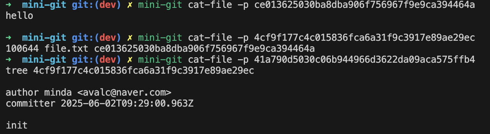

# mini-git 구조의 단순화 설계 노트 

_Last updated: 2025-06-02_ 

---
## 1. 설계 목표

> 이 프로젝트는 Git을 무작정 사용하는 것을 넘어서,  
> **내부 구조를 이해하고 설명할 수 있는 사람**이 되기 위한 학습 실험이다.

### 배경

훗날 Git을 협업에서 이용하게 될 때 내부 동작 원리를 깊이 알지 못한 채 판단을 내리는 것에 대한 **불안함**에서 시작하게 된 프로젝트이다.  
단순한 명령어 사용보다는 **Git이 내부에서 어떻게 작동하는가**를 이해하고,  
팀에게 설명할 수 있는 기술적 토대를 만들기 위해 직접 Git의 내부 구조를 따라 구현하게 되었다.

### 구현 방향

- **기능 복제보다 구조 이해**  
    실제 Git과 100% 동일한 동작보다는  Git의 핵심 객체(blob, tree, commit)와 참조 흐름(HEAD, refs 등)을 직접 구현해보며 **핵심 개념을 체화**하는 데 초점을 두었다.
    
- **최대한 유사하게, 그러나 가독성과 학습 우선**  
    zlib 압축, SHA-1 해시, 디렉토리 구조는 Git과 최대한 동일하게 구성했지만, 
    다음 요소들은 **학습과 가시성**을 우선해 단순화했다.

| 항목             | 구현 선택 이유                       |
| -------------- | ------------------------------ |
| `index` 포맷     | 바이너리 대신 JSON 사용 → 사람이 읽을 수 있도록 |
| `commit` 구조    | 텍스트 템플릿으로 작성                   |
| `checkout`     | 실제 워킹 디렉토리 변경 생략               |
| `HEAD`, `refs` | 단일 텍스트 파일로 포인터 구성              |
| `blob`, `tree` | 구조만 Git과 동일, 실제 내용은 문자열 기반     |
### 구현의 기준

- 내부 객체 구조를 코드로 체험하는 것이 최우선 가치
- Git이 지닌 **무결성, 복잡한 최적화**, 이진 인코딩은 **의도적으로 제외**
- 대신 모든 흐름을 **직관적이며 눈에 보이도록** 만드는 것을 우선

> 즉, mini-git은 **Git을 똑같이 구현하는 프로젝트가 아니라**,  
> **Git을 스스로 설명할 수 있는 사람이 되기 위한 실험 도구**다.

---

## 2. Git 대비 단순화한 설계 요소

Git과 유사한 동작을 재현했지만,  아래와 같은 요소들은 **학습 목적에 따라 단순화된 방식으로 구현**했다.

| 항목           | Git 구현                             | mini-git 구현                      | 단순화 이유                 |
| ------------ | ---------------------------------- | -------------------------------- | ---------------------- |
| 객체 저장        | zlib + 바이너리 포맷 (`blob 12\0<바이너리>`) | zlib + 문자열 기반 (`blob 12\0내용`)    | 포맷을 직접 읽고 구조를 이해할 수 있게 |
| index 포맷     | 바이너리 구조 (`.git/index`)             | JSON 파일 (`.mini-git/index.json`) | 사람이 직접 읽고 편집 가능하도록     |
| HEAD/refs 구조 | 심볼릭 참조, detached 등 복잡              | 단순 문자열 ref로 구성                   | 개념 흐름에 집중하기 위해 단순화     |
| commit 포맷    | author, committer, 서명, 시간 등        | 유사 포맷의 텍스트 구성                    | 구조는 같지만 출력 형식 다를 수 있음  |
| checkout     | 워킹 디렉토리 전체 상태 복원                   | 생략 (파일 변화 없음)                    |                        |

---

## 3. 설계 과정에서 고민했던 점

이 프로젝트에서 가장 많은 시간을 들여 고민했던 것은 **디렉토리 구조 설계**와  
**어떤 기능이 Git의 핵심 구조 학습에 적합한지 선별하는 기준**이었다.

### 📌 디렉토리 구조, core vs utils

> CLI 프로젝트는 처음이었기 때문에  
> 명령어가 포함된 구조에 맞게 디렉토리를 어떻게 나눌지 고민이 깊었다.

- `core/`: Git의 **객체 생성 및 저장**, **tree, commit **처럼  **기능 로직의 중심이 되는 구현체**를 모은 영역
- `utils/`: 경로 처리, 시간 포맷, 해시 유효성 등  **명령어와 독립적인 범용 유틸 함수들**을 분리
- 단순히 파일 위치를 나누는 것이 아니라,  _어떤 기능이 커맨드의 본질적인 로직인가?_ 를 판단해서 core에 넣는 것이 핵심이었다.

### 📌 어떤 기능을 구현해야 ‘내부 로직 학습’에 적합할까?

Git이 제공하는 수많은 명령어 중,  **어떤 명령어가 Git의 내부 구조(객체 참조, 해시, 포인터, 트리 등)**를  
가장 잘 체험할 수 있게 해주는가를 고민했다.

- `add`, `commit`, `log`, `branch`, `checkout`, `cat-file` 등을 우선 구현한 이유는  **Git의 객체 구조와 포인터 흐름**을 직접 만들어보고 출력까지 가능한 구조이기 때문
- `merge`, `rebase` 등은 복잡도 대비 학습 효율이 떨어진다고 판단해 제외함

### 📌 내부 구조는 지키되, **가시성은 최우선**

> Git의 구조를 _완벽하게 따라하는 것_ 보다,  
> 코드를 읽고 흐름을 **눈으로 따라갈 수 있는 것**이 더 중요했다.

- 해시 계산, zlib 압축, 객체 저장 방식은 최대한 Git과 동일하게 구현
- 반면 index는 JSON, commit은 템플릿 리터럴, checkout은 생략 등 **직관적 이해를 돕는 방향으로 단순화**

### 구현 과정 중 생긴 고민

>이 항목은 설계 초기보다는 실제 구현 도중 기능을 확장하거나
>유지보수하는 과정에서 **필요에 따라 자연스럽게 고민하고 리팩토링하게 된 내용**이다.

#### 💡 CLI와 테스트 환경 분리

초기 구조 설계의 연장선상에서 `basePath`를 분리해  
**`.mini-git` 폴더가 CLI와 테스트 환경에서 겹치지 않도록** 수정함

#### 💡 `index.js` if → switch → 전략 패턴으로의 진화

> 초반에는 단순한 명령어 분기였지만,  
> 명령어가 3~4개를 넘어서면서 가독성과 유지보수성이 급격히 떨어졌다.

```javascript
// 초기 구조 예시
if (command === 'init') {
  init();
} else if (command === 'add') {
  add();
} ...
```

→ `switch` 문으로 바꾸자 가독성은 나아졌지만,  명령어가 늘어날수록 **단일 파일에 명령이 몰리는 문제**가 심화

```javascript
switch (command) {
  case 'init':
    init();
    break;
  case 'add':
    add();
    break;
  ...
}
```

- 결국, **명령어가 계속 추가될 프로젝트의 특성상**  기능을 분리하고 개방-폐쇄 원칙을 지킬 수 있는 구조가 필요했음

##### 전략 패턴 도입

> 각 명령어를 객체화하여 별도로 정의하고,  
> 커맨드를 키로 받아서 실행 전략을 **맵 형태로 분기**

```javascript
const CommandStrategy = {
  init: { run: () => init() },
  add: { run: (args) => add(args) },
  ...
};

const strategy = CommandStrategy[command];
if (strategy) {
  strategy.run(args);
} else {
  console.error('알 수 없는 명령입니다.');
}
```

- 명령어별 코드가 **독립된 모듈**로 분리됨
- 새로운 명령어 추가 시 `CommandStrategy`에만 등록하면 됨
- `index.js`는 명령어 라우터로만 동작 <br>→ 가독성과 유지보수성 크게 향상

> mini-git은 단순 학습 프로젝트지만,  
> 실제 소프트웨어 아키텍처의 **리팩토링 원칙까지 적용해볼 수 있었던 경험**이 되었다.

---

## 4. 이 구조로 얻은 장점

### ① 핵심 흐름이 눈에 보이게 드러남

- 커밋, 브랜치, HEAD, refs 등 Git의 내부 참조 구조를  **파일 하나하나로 직접 조작하며 체험할 수 있음**
- 각 객체가 어떤 흐름으로 연결되는지를  **시각 자료나 디렉토리 구조만으로도 명확히 이해 가능**

### ② 디버깅과 테스트가 용이함

- 객체, 인덱스, 포인터 등의 저장 형식이  사람이 읽을 수 있는 **텍스트 기반(JSON, 문자열 헤더 등)** 으로 되어 있어  문제 발생 시 즉시 추적 가능
- 실제 저장 위치(.mini-git/objects 등)를 확인하며  저장 여부와 내부 포맷을 **명확하게 검증할 수 있음**

### ③ Git 핵심 개념 학습에 집중

- Git의 다양한 기능 중 **객체 저장, 커밋 구조, 브랜치 참조**에 집중했기 때문에  **학습 목적에 꼭 필요한 영역**만 선별적으로 구현 가능
- 복잡한 기능 대신 **핵심 로직을 체화**할 수 있음  (ex. `index → tree → commit` 흐름을 직접 따라가는 구조)

### ④ 협업 전 학습 자료로 적합

- 팀원들에게 Git의 핵심 개념을 **시각적으로 설명**할 수 있음
- 직접 구현한 구조이므로, **직접 설명할 수 있는 수준까지 내재화**됨

---

### 📌 구조가 눈에 보이는 학습 도구

#### mini-git 디렉토리 구조


>Git에서는 `.git/index`, `.git/objects` 등이 바이너리로 되어 있어 직접 확인이 어렵지만,  
>mini-git은 사람이 직접 확인하고 수정 가능한 디렉토리/파일 구조로 구성되어 있습니다.
#### `index.json` 예시
```json
{
"file.txt": "ce013625030ba8dba906f756967f9e9ca394464a"
}
```

> JSON 포맷으로 구성되어 있어 어떤 파일이 어떤 해시로 스테이징되었는지 즉시 확인 가능합니다.

#### `HEAD`, `refs` 구조 예시

> 브랜치 포인터 구조가 Git과 동일하지만, 텍스트 파일로 구성되어 있어 쉽게 추적할 수 있습니다.
#### `cat-file -p` 예시

> Git처럼 압축 저장되지만, `\0` 이후의 실제 내용이 문자열 기반이라 디버깅과 학습에 적합합니다.

---
## 5. 실제 Git과의 차이점 주의

이 프로젝트는 Git의 핵심 개념을 학습하기 위한 **실험적 구현**이며,  실제 Git과 다음과 같은 차이점이 존재합니다.

| 항목            | Git                                 | mini-git                                   | 주의할 점                 |
| ------------- | ----------------------------------- | ------------------------------------------ | --------------------- |
| index 저장 형식   | 바이너리                                | JSON                                       | 내부 최적화 생략             |
| commit 포맷     | author, committer, parent, 시간, 서명 등 | author, committer, parent, message, 시간만 포함 | 구조 유사하지만 일부 포맷 형식의 차이 |
| 객체 무결성 검증     | - 해시 기반<br>- 추가 무결성 체크              | 해시 기반만 구현                                  | 손상 감지는 미구현            |
| .gitignore 적용 | 있음                                  | 없음                                         | 모든 파일을 추적 대상으로 간주     |
| 브랜치 명령어       | - 다양한 병합<br>- rebase 등 포함           | 단순 분기 및 이동만 구현                             | 고급 기능 생략              |
| 워킹 디렉토리 관리    | checkout 시 파일 변경까지 포함               | 파일 변경 생략                                   | 실파일 이동은 미구현           |

### 실무 적용과의 거리

> ⚠️ 이 구현은 **학습 목적의 실험 도구**이며, <br>실제 Git의 동작 속도, 무결성 검증, 브랜치 전략, 협업 기능 등은 포함되어 있지 않습니다.

- **실제 Git과 완전히 동일한 동작을 기대하면 안 됨**
- 다만 **내부 구조(객체, 참조, 해시 등)의 흐름을 체화**하는 데는 유효함

---

### 📌 정리

- **mini-git은 Git을 모방한 것이 아니라, Git을 이해하기 위한 실험 도구**
- 실무에서 사용하는 Git과 비교해 단순화된 요소가 많지만,<br>그 덕분에 **핵심 개념을 투명하게 관찰할 수 있음**